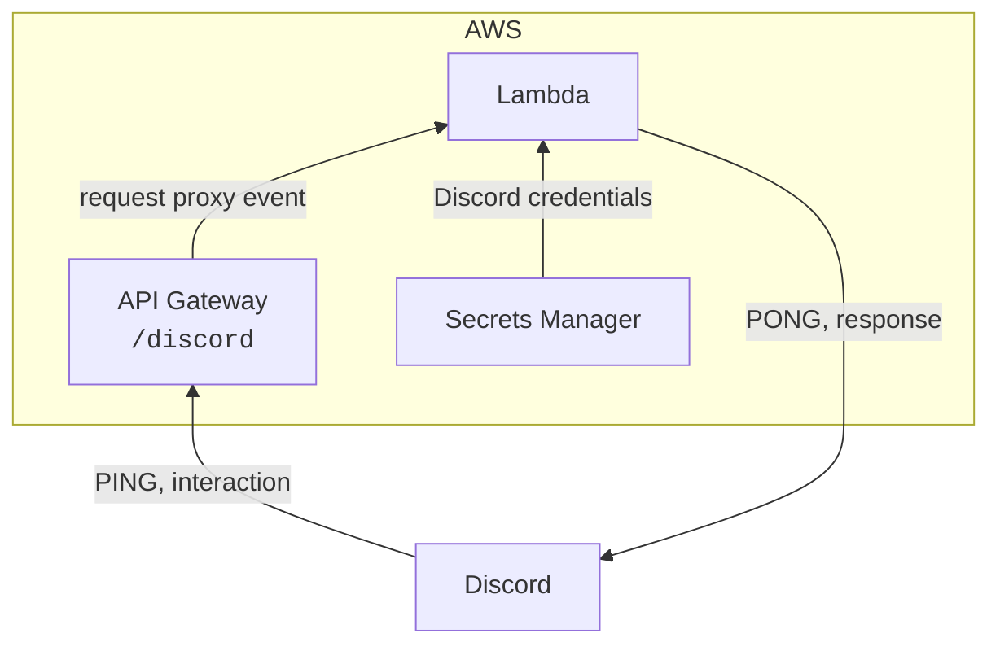

# Adventus

A (hopefully) fun Discord bot.

## Usage

Adventus can be added to your server using [this link](https://discord.com/api/oauth2/authorize?client_id=1074795024946036889&scope=applications.commands).

### Dice Roller

Use the `/roll` command to roll a dice. Documentation is provided in the pop-up. Optionally, use the `rolls` option to roll multiple dice with the same number of sides.

For example:

- `/roll sides: 20` returns: "`@user` rolled 13."
- `/roll sides: 6 rolls: 2` returns: "`@user` rolled 2, 5."

## How does it work?

### Architecture

Discord interactions allow for handling commands serverlessly. Upon using the slash command documented above, Discord makes a POST request to the Adventus API at the endpoint, `/discord`. See the Discord interactions documentation [here](https://discord.com/developers/docs/interactions/receiving-and-responding). This is forwarded by API Gateway to a Lambda that handles the request (using the AWS Lambda Powertools [REST API framework](https://awslabs.github.io/aws-lambda-powertools-python/2.12.0/core/event_handler/api_gateway/)). It calculates the dice roll(s) based on the values provided for `sides` and (optionally) `rolls` and responds to the author with a message reporting the outcome.

[As required by Discord](https://discord.com/developers/docs/interactions/receiving-and-responding#receiving-an-interaction), the API is prepared to respond to a PING message with a PONG and validates the request signatures to authenticate the request. Discord will occasionally send requests with incorrect sigantures to check (expects a 401) that there is authentication in place.

Finally, the Discord credentials required by the application are stored in SSM Parameter Store and retrieved upon instantiation of the Lambda (per instance rather than per call).

### Registering Commands

Commands like `/roll` must be registered with Discord before they can be used. Currently (as of commit date), this can only be done by [making a POST request to the Discord API](https://discord.com/developers/docs/interactions/application-commands#making-a-global-command). [`command_registration_body.json`](command_registration_body.json) is the body of the request used to register the `/roll` command.

### Infrastructure

The AWS infrastructure is defined using [CloudFormation](https://aws.amazon.com/cloudformation/) in [`template.yaml`](template.yaml) and is deployed using [AWS SAM](https://aws.amazon.com/serverless/sam/).

## Devcontainer Setup

This project can be opened in a devcontainer using the *Dev Containers: Clone Repository in Container Volume* command. It will use the `.devcontainer/devcontainer.json` to build the development container.

The following needs to be done manually after initialising the container. Eventually, I'd like to automate this using a Dockerfile or `"postCreateCommand"` in `devcontainer.json`.

1. Run the following.
2. `cargo install cargo-shuttle` (and authenticate with `cargo shuttle login`).
